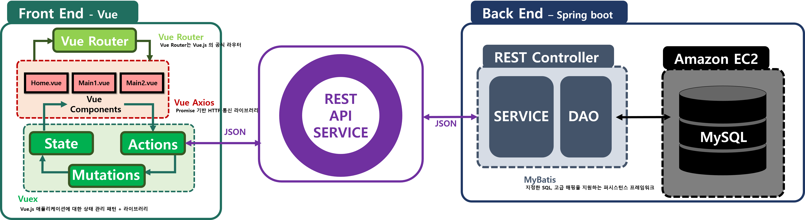
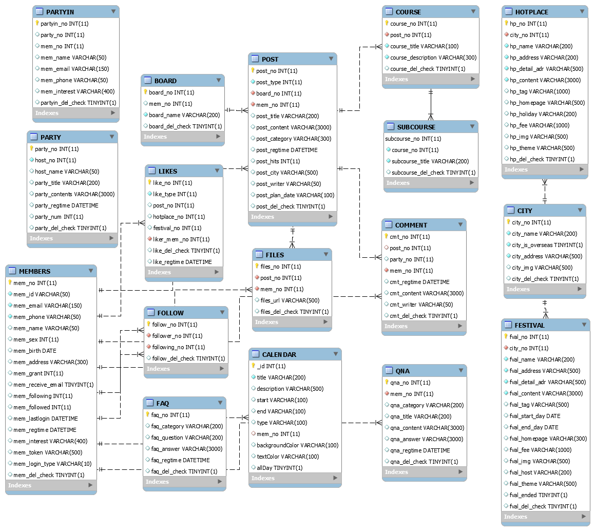
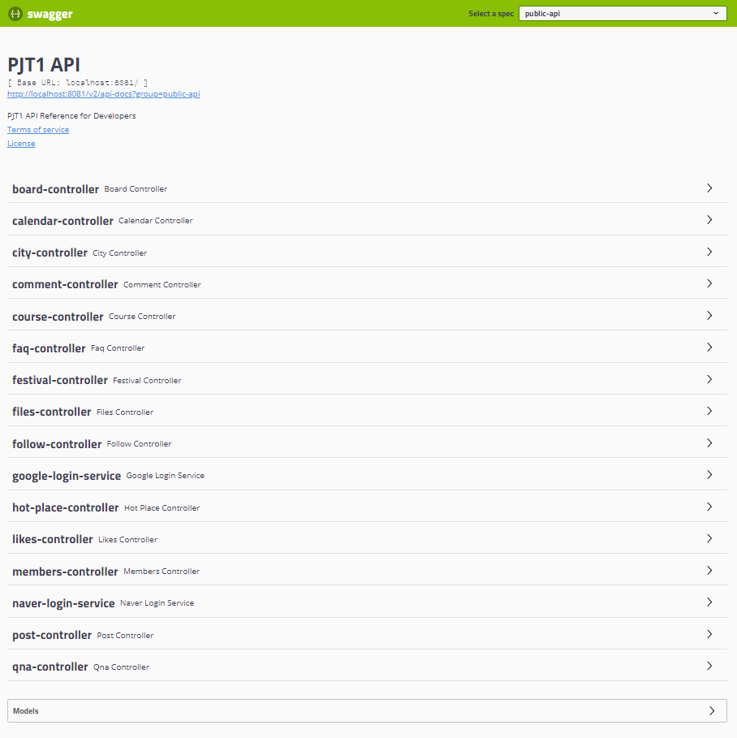

# **4반 2조 Violet조**

## **트래블 브릿지 (Travel Bridge)**

## 목차

1. [서비스 소개](#서비스-소개)
1. [주요 기능](#주요-기능)
1. [메타데이터](#TavelBridge-메타데이터)
1. [서비스 예시](#서비스-예시)
1. [테스트](#테스트)
1. [팀 구성](#팀-구성)
1. [사용 툴](#사용-툴)

## **서비스 소개**


여행 관련 서비스들을 묶어 서비스 체류시간을 늘리고  
사용자에게 한곳에서 여러 여행 정보를 제공할 수 있는 서비스.

## **주요 기능**

- 여행지 추천 서비스
- 여행 후기 및 일정표 공유 기능
- SNS 서비스
- 내일로 랜덤 여행 루트 서비스
- 전국 여행 스탬프 서비스
- 동반자 찾기 서비스

---
## **TravelBridge 메타데이터**

### **1. 시스템 구조도**



- FRONT-END는 Vue.js의 모듈로 구성하고 Spring Boot를 통해 개발된 BACK-END와 REST API로 비동기 통신하며 서비스를 제공

### **2. 기술스택**


 - ## **FRONT-END**
    - HTML5
    - CSS
    - JavaScript
    - Vue.js
    - Quasar

  - ## **BACK-END**
    - Java
    - Spring Boot
    - MySQL

  - ## **BACK-Server**
    - Ubuntu
    - Amazon EC2
    - NGINX

  - ## **Collecting DATA**
    - Python
    - Selenium
    - BeautifulSoup

  - ## **Management**
    - Code
        - git
        - gitlab
    - Issue
        - Jira SoftWare

### [**3. 테이블 설계**](./metadata_description/TABLE.md)

<div style="text-align:center">
    
</div>

### [**4. API 문서**](./metadata_description/APIDocumentaion.md)

<div style="text-align:center">
    
</div>
---

## **서비스 예시**


## **테스트**

- ### 서비스 도메인 주소 
    - http://i02a402.p.ssafy.io/

- ### 테스트 회원 정보
    ```
    tester id : merung@hanmail.net
    tester pw : qwer1234
    ```

## **팀 구성**

### 1. 프론트엔드

- `팀장` 김수민
    -   ?
    -   필수 기능 프론트엔드 담당
    -   여행 추천 서비스 프론트엔드 담당  

- 김준목
    -   ?
    -   로그인 관련 프론트엔드 담당
    -   개인 맞춤형 SNS 피드 프론트엔드 담당

### 2. 백엔드

- 정구헌
    -   DB 설계 
    -   필수 기능 백엔드 담당
    -   여행 추천 서비스 백엔드 담당

- 신지영
    -   데이터 수집 및 정제
    -   로그인 관련 백엔드 담당
    -   개인 맞춤형 SNS 피드 백엔드 담당
    

## **사용 툴**

- Visual Studio Code
- Spring Tool Suite4
- MySQL Workbench
- git(git bash) / gitlab(lab.ssafy.com) / jira (jira.ssafy.com)


