# **4반 2조 Violet조**

## **트래블 브릿지 (Travel Bridge)**

## 목차

1. [서비스 소개](#서비스-소개)
1. [주요 기능](#주요-기능)
1. [메타데이터](#TavelBridge-메타데이터)
1. [서비스](#서비스)
1. [테스트](#테스트)
1. [팀 구성](#팀-구성)
1. [사용 툴](#사용-툴)

## **서비스 소개**

### **1. BRIDGE의 의미**

#### - **고객 (Influencer)과 다양한 여행 경험들을 이어주는 서비스 구현이 목표**

>**1) `B`RIDGE** (Break generation gap)   
>  세대를 아우르는 '여행' 열풍  
>**2) B`R`IDGE** (Recreation)  
>  즐거운 액티비티와 체험  
>**3) BR`I`DGE** (Influencer)  
> 여행 경험을 공유하는 모두가 인플루엔서  
>**4) BRI`D`GE** (Delicious food)   
> 맛있는 음식과 함께  
>**5) BRID`GE`** (Go anywhere, East cost)  
> 일상에서 즐기는 여행

### **2. BRIDGE로써의 기능**

#### - **여행 통합 서비스의 부재와 니즈에 대한 해결**

여행을 가고 싶어하는 사람들이 많은 반면 여행지 정보를 수집하는 것은 여행 사이트, 블로그 후기 등 여러 곳에서 직접 찾고 비교해야하는 불편함이 존재합니다.

따라서 저희 서비스에서는  
 1. "**여행을 가고 싶은 사람**"을 위해 일정 작성 및 공유할 공간을 제공하고, 맞춤형으로 여행지와 축제 정보를 제공합니다.

 2. "**여행을 다녀 온 사람**"을 위해 자신의 여행을 기록하고, 공유할 수 있는 공간을 제공합니다.  

 3. "**여행을 좋아하는 사람**"에게는 함께 여행할 수 있도록 지원하며, 선의의 경쟁심을 유도합니다.  

 이를 통해, 여행에 관하여 통합된 정보를 제공하고, SNS형태로 후기들을 공유하며 여행이라는 키워드를 중심으로 다양한 서비스를 제공하여 확장성 있는 커뮤니티 플랫폼을 설계하였습니다.

### **3. Service Flow**

#### - **고객의 체류시간을 높일 수 있는 선순환적 구조**

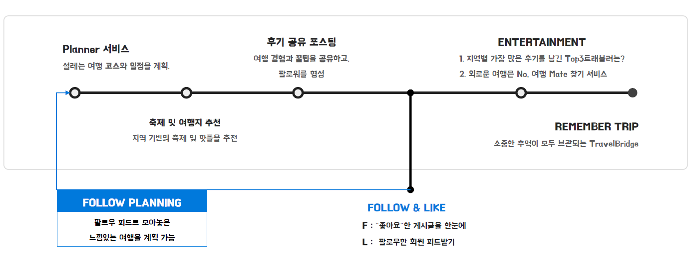

## **주요 기능**

- 여행지 추천 서비스
- 여행 후기 및 일정표 공유 기능
- SNS 서비스
- 전국 여행 스탬프 서비스
- 동반자 찾기 서비스

---
## **TravelBridge 메타데이터**

### **1. 시스템 구조도**


- FRONT-END는 Vue.js의 모듈로 구성하고 Spring Boot를 통해 개발된 BACK-END와 REST API로 비동기 통신하며 서비스를 제공

### **2. 기술스택**


 - ## **FRONT-END**
    - HTML5
    - CSS
    - JavaScript
    - Vue.js
    - Quasar

  - ## **BACK-END**
    - Java
    - Spring Boot
    - MySQL

  - ## **BACK-Server**
    - Ubuntu
    - Amazon EC2
    - NGINX

  - ## **Collecting DATA**
    - Python
    - Selenium
    - BeautifulSoup

  - ## **Management**
    - Code
        - git
        - gitlab
    - Issue
        - Jira SoftWare

### [**3. 테이블 설계**](./metadata_description/TABLE.md)

<div style="text-align:center">
    
</div>

### [**4. API 문서**](./metadata_description/APIDocumentaion.md)

<div style="text-align:center">
    
</div>

---

## **서비스**

### 1. Home


### 2. Travel Card


### 3. Travel Card Feed

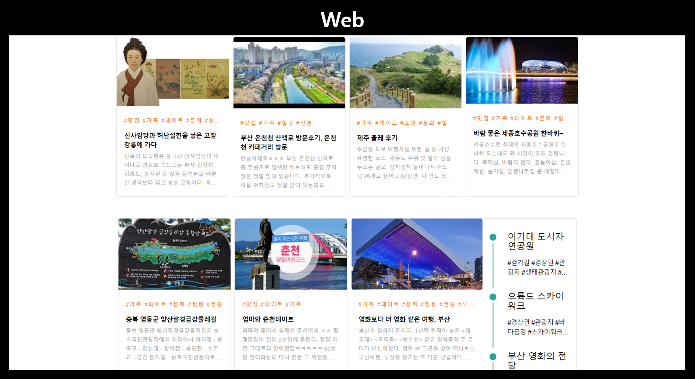

### 4. Write Travel Card

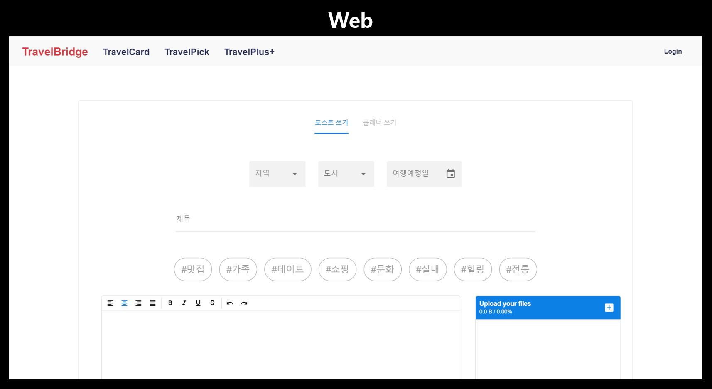

### 5. Travel Pick 


### 6. Travel Pick List

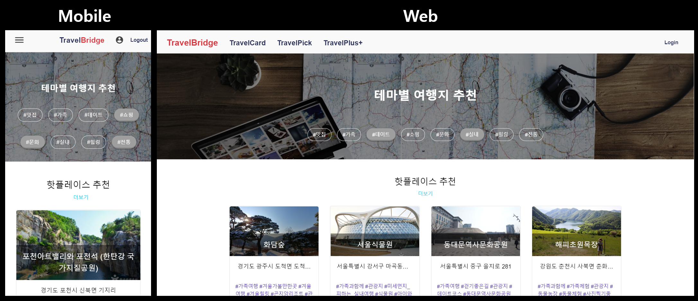

### 7. Searched Travel Pick

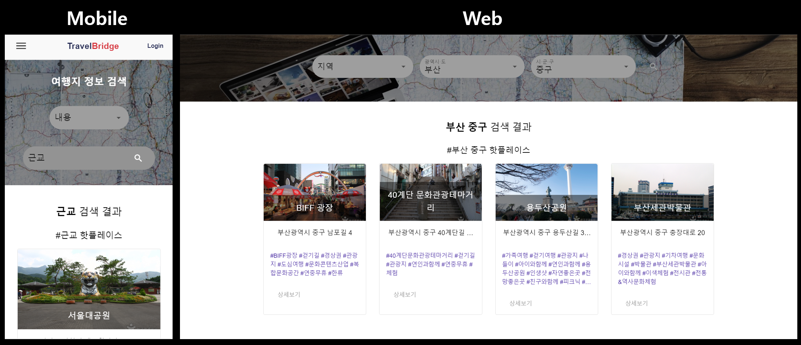

### 8. TravelPlus - Party

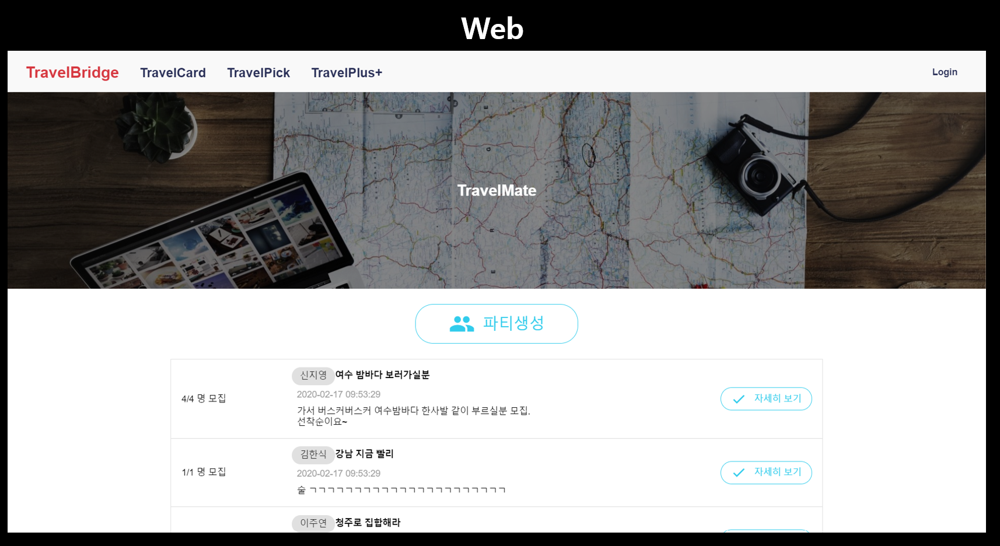

### 9. TravelPlus - Create Party

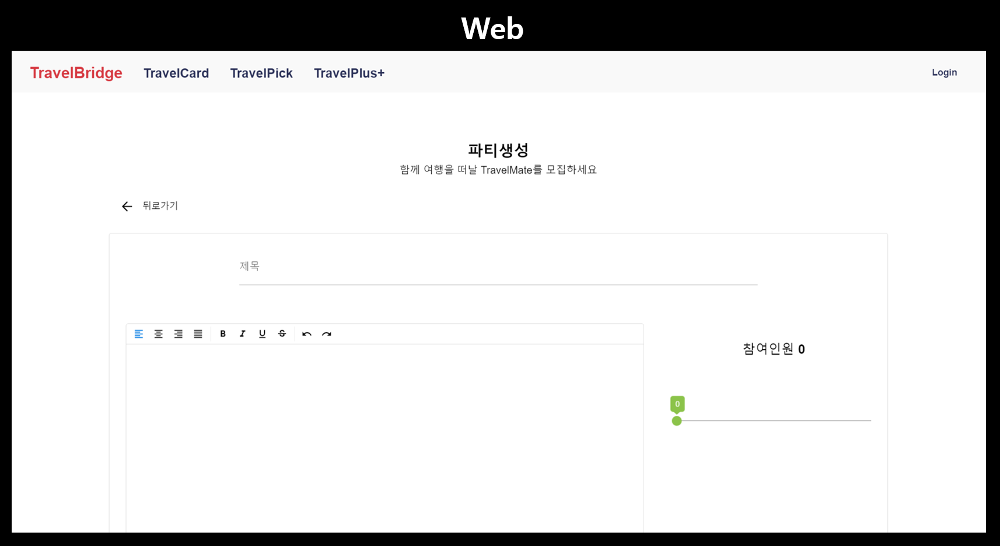

### 10. TravelPlus - Take part in the party

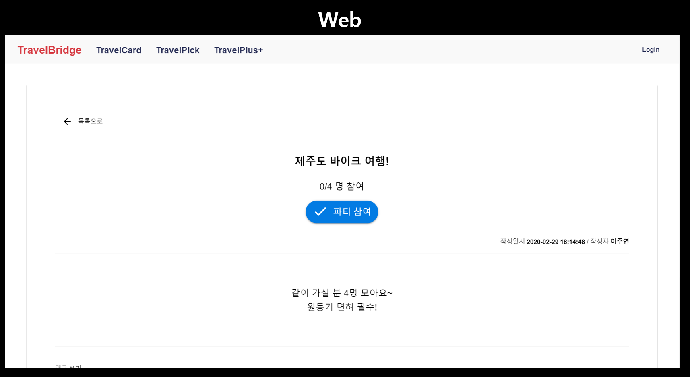

### 11. TravelPlus - Ranking

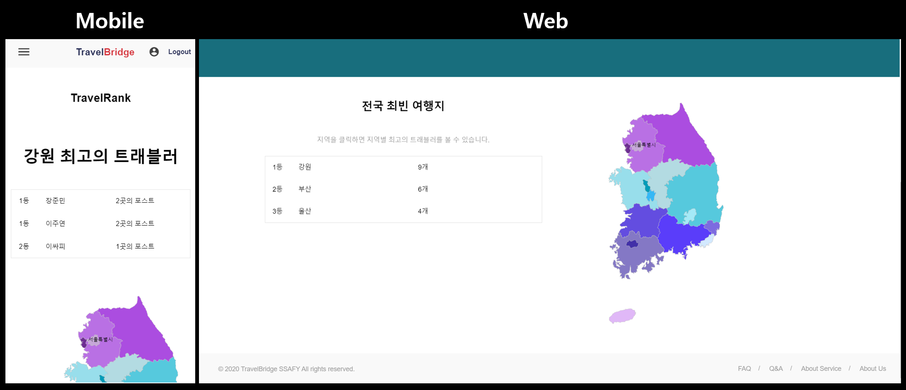

### 12. MyPage - Follow, Information

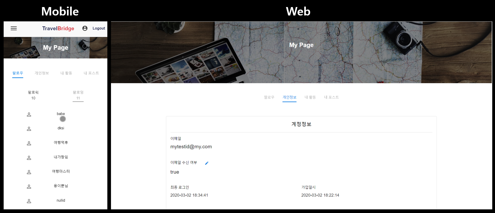

### 13. MyPage - Activity i did

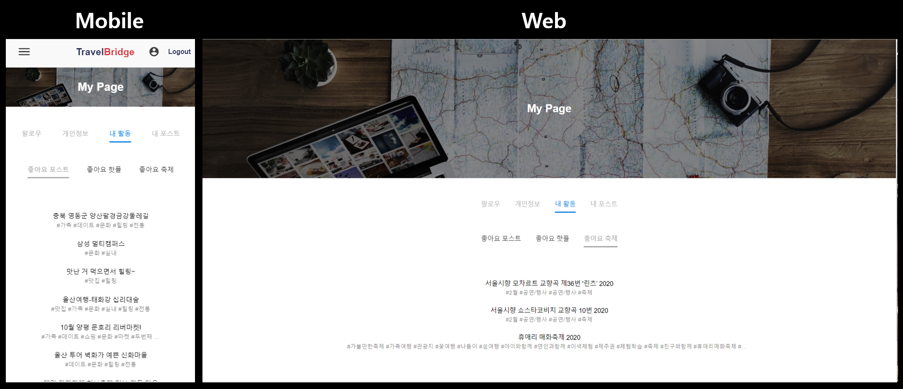

## **테스트**

- ### 서비스 도메인 주소 
    - http://i02a402.p.ssafy.io/

- ### 테스트 회원 정보
    ```
    tester id : merung@hanmail.net
    tester pw : qwer1234
    ```

## **팀 구성**

### 1. 프론트엔드

- `팀장` 김수민
    -   필수 기능 프론트엔드 담당
    - 여행지 테마 추천 서비스 프론트엔드 담당
    - 여행지 검색 서비스 프론트엔드 담당

- 김준목
    -   회원관리 기능 프론트엔드 담당
    - 여행 정보 공유 서비스 프론트엔드 담당
    - SNS 피드 서비스 프론트엔드 담당

### 2. 백엔드

- 정구헌
    -   DB 설계 
    -   필수 기능 백엔드 담당
    -   여행 추천 서비스 백엔드 담당

- 신지영
    -   데이터 수집 및 정제
    -   로그인 관련 백엔드 담당
    -   개인 맞춤형 SNS 피드 백엔드 담당
    

## **사용 툴**

- Visual Studio Code
- Spring Tool Suite4
- MySQL Workbench
- git(git bash) / gitlab(lab.ssafy.com) / jira (jira.ssafy.com)


