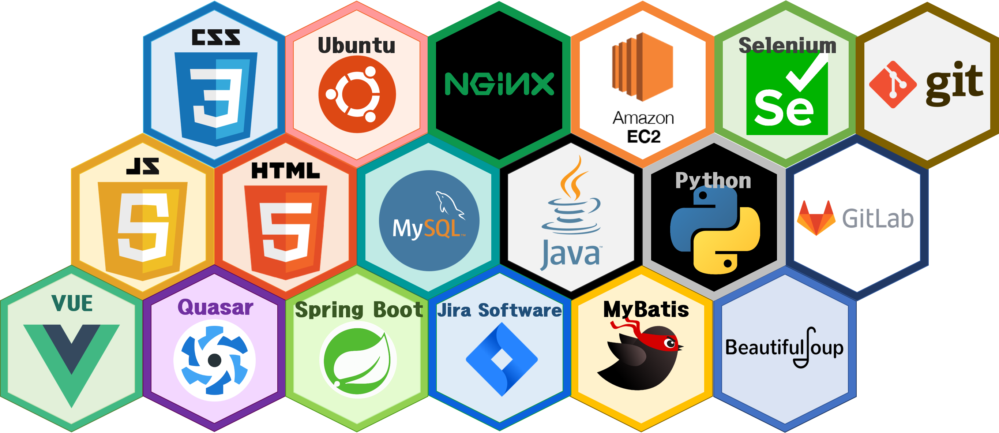
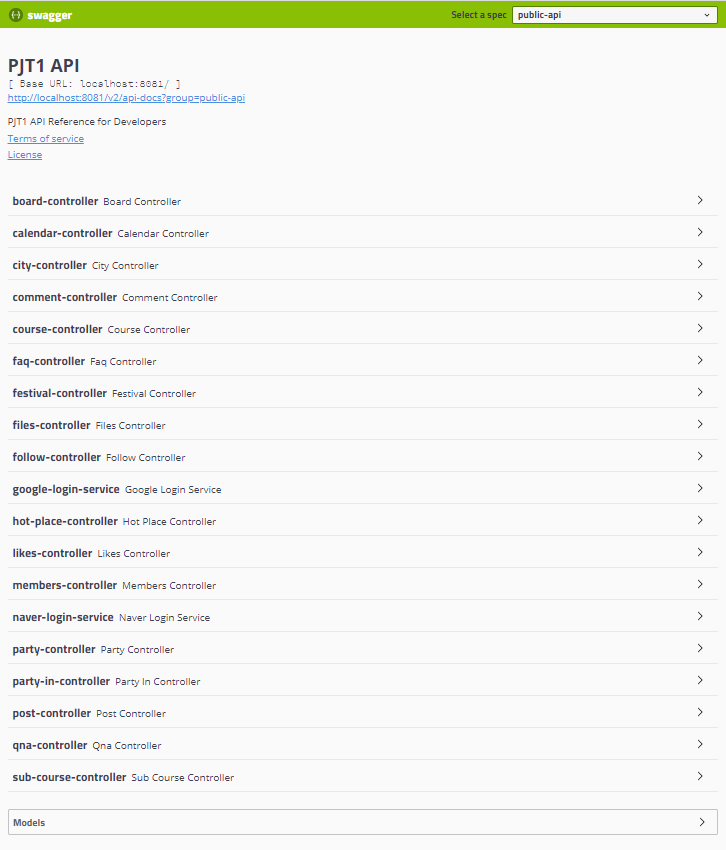

# **4반 2조 Violet조**

## **트래블 브릿지 (Travel Bridge)**

## 목차

1. [서비스 소개](#서비스-소개)
1. [주요 기능](#주요-기능)
1. [설계](#설계)
1. [서비스 예시](#서비스-예시)
1. [팀 구성](#팀-구성)
1. [사용 툴](#사용-툴)

## **서비스 소개**

여행 관련 서비스들을 묶어 서비스 체류시간을 늘리고  
사용자에게 한곳에서 여러 여행 정보를 제공할 수 있는 서비스.

## **주요 기능**

- 여행지 추천 서비스
- 포스트 및 일정표 공유 기능
- SNS 서비스
- 전국 여행 스탬프 서비스
- 동반자 찾기 서비스
- 내일로 랜덤 여행 루트 서비스

---
## **TravelBridge Meta Data**

## **1. 시스템 구조도**

- FRONT-END

- REST API

- BACK-END

## **2. 기술스택**

 - ## **FRONT-END**
    - HTML5
    - CSS
    - JavaScript
    - Vue.js
    - Quasar

  - ## **BACK-END**
    - Java
    - Spring Boot
    - MySQL

  - ## **BACK-Server**
    - Ubuntu
    - Amazon EC2
    - NGINX

  - ## **관리**
    - 코드
    - git
    - gitlab
    - 이슈
    - Jira SoftWare

## [**3. 테이블 설계**](./metadata_description/TABLE.md)

## [**4. API 문서**](./metadata_description/APIDocumentaion.md)

---
## 설계

## 서비스 예시

## 팀 구성

프론트엔드

- `팀장` 김수민
- 김준목

백엔드

- 정구헌
- 신지영

## 사용 툴
