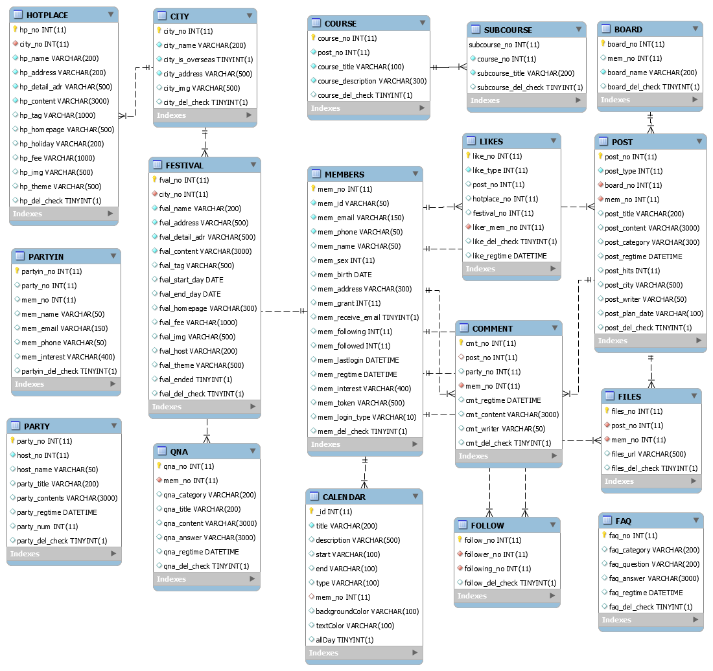

# **SHOW TABLES**
1. BOARD  
1. CALENDAR  
1. CITY  
1. COMMENT  
1. COURSE  
1. FAQ  
1. FESTIVAL  
1. FILES  
1. FOLLOW  
1. HOTPLACE  
1. LIKES  
1. MEMBERS  
1. PARTY  
1. PARTYIN  
1. POST  
1. QNA  
1. SUBCOURSE  

# **0. ERD**

# **1. Board**

|Field|Type|Null|Key|Default|Extra|Description|
|-|-|-|-|-|-|-|
|board_no	        | int(11)	    |NO	 |PRI   |	| auto_increment|게시판 관리 번호|
|mem_no  	        | int(11)	    |YES |	    |	||해당 회원의 피드|
|board_name	        | varchar(200)  |NO	 |	    |   ||게시판 이름|
|board_del_check	| tinyint(1)	|YES |	    | 0	||게시판 삭제여부|

# **2. Calendar**
 - 라이브러리 사용으로 인해 필드명 고정

|Field|Type|Null|Key|Default|Extra|Description|
|-|-|-|-|-|-|-|
|_id	            |int(11)	    |NO	|PRI||auto_increment|캘린더 관리 번호|
|title	            |varchar(200)	|NO	|	|||일정 제목|
|description	    |varchar(500)	|YES|	|||일정 메모|	
|start	            |varchar(100)	|YES|	|||일정 시작일|	
|end	            |varchar(100)	|YES|	|||일정 마감일|	
|type	            |varchar(100)	|YES|	|||일정 카테고리|	
|mem_no	            |int(11)	    |YES|MUL|||회원 번호|		
|backgroundColor	|varchar(100)	|YES|	|||일정 배경색|	
|textColor	        |varchar(100)	|YES|	|||폰트 색|	
|allDay	            |tinyint(1)	    |YES|	|||선택사항|	

# **3. City**
|Field|Type|Null|Key|Default|Extra|Description|
|-|-|-|-|-|-|-|
|city_no	        |int(11)	    |NO	|PRI|	|auto_increment|도시 관리번호|
|city_name	        |varchar(200)	|NO	|	|||도시 이름|
|city_is_overseas	|tinyint(1)	    |NO	|	|||국내/해외 여부|
|city_address	    |varchar(500)	|NO	|	|||도시 주소|
|city_img	        |varchar(500)	|YES|	|||도시 이미지|
|city_del_check	    |tinyint(1)	    |YES|	|0||도시 삭제 여부|

# **4. Comment**
|Field|Type|Null|Key|Default|Extra|Description|
|-|-|-|-|-|-|-|
|cmt_no	        |int(11)	    |NO	|PRI|	|auto_increment|댓글 관리번호|
|post_no	    |int(11)	    |NO	|MUL|	||게시물 번호|
|mem_no	        |int(11)	    |NO	|MUL|	||게시글 작성자 번호|
|cmt_regtime	|datetime	    |YES|	|CURRENT_TIMESTAMP|	|댓글 작성 일시|
|cmt_content	|varchar(3000)	|YES|	|	||댓글 내용|
|cmt_writer	    |varchar(50)	|YES|	|	||댓글 작성자|
|cmt_del_check	|tinyint(1)	    |YES|	|0	||댓글 삭제 여부|

# **5. Course**
|Field|Type|Null|Key|Default|Extra|Description|
|-|-|-|-|-|-|-|
|course_no	        |int(11)	    |NO	|PRI| |auto_increment|코스 관리번호|
|post_no	        |int(11)	    |NO	|MUL| |	|참조하는 게시글 번호|
|course_title	    |varchar(100)	|NO	|	| | |코스 제목(방문 장소 (ex) 송화마을)|
|course_description	|varchar(300)	|NO	|	| | |간략한 첨부 내용|
|course_del_check	|tinyint(1)	    |YES|	|0|	|코스 삭제여부|

# **6. FAQ**
|Field|Type|Null|Key|Default|Extra|Description|
|-|-|-|-|-|-|-|
|faq_no	        |int(11)	    |NO	|PRI|	|auto_increment|자주하는 질문 관리번호|
|faq_category	|varchar(200)	|YES|	|	||질문 카테고리|
|faq_question	|varchar(200)	|YES|	|	||질문 제목|
|faq_answer	    |varchar(3000)	|YES|	|	||답변 내용|
|faq_regtime	|datetime	    |YES|	|CURRENT_TIMESTAMP||등록 시간|
|faq_del_check	|tinyint(1)	    |YES|	|0	||삭제 여부|

# **7. Festival**
|Field|Type|Null|Key|Default|Extra|Description|
|-|-|-|-|-|-|-|
|fval_no	        |int(11)	    |NO	|PRI||auto_increment|축제 관리번호|
|city_no	        |int(11)	    |NO	|MUL|||도시 번호|
|fval_name	        |varchar(200)	|NO	|	|||축제 명|
|fval_address	    |varchar(500)	|NO	|	|||축제 주소|
|fval_detail_adr	|varchar(500)	|NO	|	|||축제 상세주소|
|fval_content	    |varchar(3000)	|NO	|	|||축제 컨텐츠|
|fval_tag	        |varchar(500)	|YES|	|||축제 태그|
|fval_start_day	    |date	        |YES|	|||축제 시작일|
|fval_end_day	    |date	        |YES|	|||축제 종료일|
|fval_homepage	    |varchar(300)	|YES|	|||축제 홈페이지|
|fval_fee	        |varchar(1000)	|YES|	|||축제 비용|
|fval_img	        |varchar(500)	|YES|	|||축제 이미지|
|fval_host	        |varchar(200)	|YES|	|||축제 주최자|
|fval_theme	        |varchar(500)	|YES|	|||축제 테마|
|fval_ended	        |tinyint(1)	    |YES|	|0|축제 종료여부|
|fval_del_check	    |tinyint(1) 	|YES|	|0|축제 삭제 여부|

# **8. Files**
|Field|Type|Null|Key|Default|Extra|Description|
|-|-|-|-|-|-|-|
|files_no	        |int(11)	    |NO	|PRI||auto_increment|파일 관리 번호|
|post_no	        |int(11)	    |NO	|MUL|||게시물 번호|
|mem_no	            |int(11)	    |NO	|MUL|||게시물 등록 회원 번호|
|files_url	        |varchar(500)	|YES|	|||파일 경로|
|files_del_check	|tinyint(1)	    |YES|	|0||파일 삭제 여부|	

# **9. Follow**

|Field|Type|Null|Key|Default|Extra|Description|
|-|-|-|-|-|-|-|
|follow_no	        |int(11)	|NO|PRI||auto_increment |팔로우 관리번호|
|follower_no	    |int(11)	|NO|MUL|||팔로우 하는 회원|
|following_no	    |int(11)	|NO|MUL|||팔로우 당하는 회원|
|follow_del_check   |tinyint(1)	|YES||0	||삭제 여부|

# **10. Hotplace**
|Field|Type|Null|Key|Default|Extra|Description|
|-|-|-|-|-|-|-|
|hp_no	        |int(11)	    |NO	|PRI|	|auto_increment|핫플 관리번호|
|city_no	    |int(11)	    |NO	|MUL|	||도시 번호|
|hp_name	    |varchar(200)	|NO	|	|   ||핫플 이름|
|hp_address	    |varchar(200)	|NO	|	|   ||핫플 주소|
|hp_detail_adr	|varchar(500)	|NO	|	|   ||핫플 상세주소|
|hp_content	    |varchar(3000)	|NO	|	|   ||핫플 컨텐츠|
|hp_tag	        |varchar(1000)	|YES|	|	||핫플 태그|
|hp_homepage	|varchar(500)	|YES|	|	||핫플 홈페이지|
|hp_holiday	    |varchar(200)	|YES|	|	||핫플 휴일|
|hp_fee	        |varchar(1000)	|YES|	|	||핫플 요금|
|hp_img	        |varchar(500)	|YES|	|	||핫플 이미지|
|hp_theme	    |varchar(500)	|YES|	|	||핫플 테마|
|hp_del_check	|tinyint(1)	    |YES|	|0	||핫플 삭제 여부|

# **11. Likes**
|Field|Type|Null|Key|Default|Extra|Description|
|-|-|-|-|-|-|-|
|like_no	    |int(11)	|NO	|PRI|	|auto_increment|좋아요 관리번호|
|like_type	    |int(11)	|NO	|	|   ||좋아요 위치(1:게시물,2:핫플,3:축제)|
|post_no	    |int(11)	|YES|	|0	||게시물 번호|
|hotplace_no	|int(11)	|YES|	|0	||핫플 번호|
|festival_no	|int(11)	|YES|	|0	||축제번호|
|liker_mem_no	|int(11)	|NO	|MUL|	||좋아요 한 회원 외래키|
|like_del_check	|tinyint(1)	|YES|	|0	||삭제 여부|

# **12. Members**

|Field|Type|Null|Key|Default|Extra|Description|
|-|-|-|-|-|-|-|
|mem_no	            |int(11)	    |NO	|PRI| |auto_increment   |회원 관리번호|
|mem_id	            |varchar(50)	|NO	|UNI| |                 |아이디|
|mem_email	        |varchar(150)	|NO	|UNI| |                 |이메일|
|mem_phone	        |varchar(50)	|NO	|UNI| |                 |핸드폰번호|
|mem_name	        |varchar(50)	|YES|	| |                 |이름|
|mem_sex	        |int(11)	    |YES|	| |                 |성별 0: 남 1:여|
|mem_birth	        |date	        |YES|	| |                 |생년월일| 
|mem_address	    |varchar(300)	|YES|	| |                 |주소|
|mem_grant	        |int(11)	    |YES|	|0|                 |멤버 권한 (0:방문자, 1:관리자, 2:팀원)|
|mem_receive_email	|tinyint(1)	    |YES|	|1|                 |이메일 수신여부|
|mem_following	    |int(11)	    |YES|	|0|                 |팔로잉 수|
|mem_followed	    |int(11)	    |YES|	|0|                 |팔로우 수|
|mem_lastlogin	    |datetime	    |YES|	|CURRENT_TIMESTAMP  ||마지막 로그인 시간	|
|mem_regtime	    |datetime	    |YES|	|CURRENT_TIMESTAMP  ||관심 카테고리들|
|mem_interest	    |varchar(400)	|YES|	||                  |회원 가입 시간|
|mem_token	        |varchar(500)	|YES|	||                  |로그인처리 토큰|
|mem_login_type	    |varchar(10)	|YES|	||                  |소셜로그인 종류 0, 1, 2, 3(기본,구글,네이버,깃허브)|
|mem_del_check	    |tinyint(1)	    |YES|	|0|                 |삭제여부|

# **13. Party**
|Field|Type|Null|Key|Default|Extra|Description|
|-|-|-|-|-|-|-|
|party_no	    |   int(11)	        |NO	|PRI|	                |auto_increment|파티번호|
|host_no	    |   int(11)	        |NO	|	|                   |              |주최자 번호|
|host_name	    |   varchar(50)	    |YES|	|	                |              |주최자 이름|
|party_title	|   varchar(200)    |YES|	|	                |              |파티 제목|
|party_contents	|   varchar(3000)	|YES|	|	                |              |파티 내용|
|party_regtime	|   datetime	    |YES|	|CURRENT_TIMESTAMP  |DEFAULT_GENERATED |파티 등록시간|
|party_num	    |   int(11)	        |YES|	|1	                |                  |파티 인원수|
|party_del_check|   tinyint(1)	    |YES|	|0	                |                  |파티 삭제여부|

# **14. PartyIn**
|Field|Type|Null|Key|Default|Extra|Description|
|-|-|-|-|-|-|-|
|partyin_no	       |int(11)     	|NO	|PRI|	|auto_increment|파티 참가 관리번호|
|party_no	       |int(11)	        |YES|	|	|              |파티 번호|
|mem_no	           |int(11)	        |YES|	|	|              |회원 번호|
|mem_name	       |varchar(50)	    |YES|	|	|              |회원 이름|
|mem_email	       |varchar(150)	|YES|	|	|              |회원 이메일|
|mem_phone	       |varchar(50)	    |YES|	|	|              |회원 핸드폰|   
|mem_interest	   |varchar(400)	|YES|	|	|              |회원 관심사|
|partyin_del_check |tinyint(1)	    |YES|	|0  |	           |파티 참가 삭제여부|    

# **15. Post**
|Field|Type|Null|Key|Default|Extra|Description|
|-|-|-|-|-|-|-|
|post_no	        |int(11)	    |NO	|PRI|	|auto_increment | |게시글 관리번호
|post_type	        |int(11)	    |NO	|	|	||후기(사진등 추가) : 0, 일정(양식) : 1 |
|board_no	        |int(11)	    |NO	|MUL|	||게시판 번호|	
|mem_no  	        |int(11)	    |NO	|MUL|	||작성자 번호|	
|post_title	        |varchar(200)	|YES|	|	||게시글 제목	|	
|post_content	    |varchar(3000)	|YES|	|	||게시글 내용|	
|post_category	    |varchar(300)	|YES|	|	||게시글 카테고리 = 태그|	
|post_regtime	    |datetime	    |YES|	|CURRENT_TIMESTAMP	||게시글 작성시간
|post_hits	        |int(11)	    |YES|	|0	||게시글 조회수|
|post_city	        |varchar(500)	|YES|	|	||지역(해시태그) 달기|	
|post_plan_start	|date	        |YES|	|	||	일정 시작날짜|
|post_plan_end	    |date	        |YES|	|	||	일정 끝 날짜|
|post_plan_title	|varchar(200)	|YES|	|	||	일정 제목|
|post_writer	    |varchar(50)	|YES|	|	||	작성자|
|post_del_check	    |tinyint(1)	    |YES|	|0	||삭제 여부|

# **16. QNA**
|Field|Type|Null|Key|Default|Extra|Description|
|-|-|-|-|-|-|-|
|qna_no	        |int(11)	    |NO	|PRI|	|auto_increment|Q&A 관리번호|
|mem_no	        |int(11)	    |NO	|MUL|	||질문한 회원 번호|
|qna_category	|varchar(200)	|YES|	|	||Q&A 카테고리|
|qna_title	    |varchar(200)	|YES|	|	||Q&A 질문 제목|
|qna_content	|varchar(3000)	|YES|	|	||Q&A 질문 내용|
|qna_answer	    |varchar(3000)	|YES|	|	||Q&A 답변 내용|
|qna_regtime	|datetime	    |YES|	|CURRENT_TIMESTAMP	||등록 시간|
|qna_del_check	|tinyint(1)	    |YES|	|0	||Q&A 삭제 여부|

# **17. SUBCOURSE**
|Field|Type|Null|Key|Default|Extra|Description|
|-|-|-|-|-|-|-|
|subcourse_no	        |int(11)	    |NO	|PRI|	|auto_increment |SubCourse 관리번호|
|course_no	            |int(11)	    |NO	|	|   |               |Course 번호|
|subcourse_title	    |varchar(200)	|NO	|	|   |               |SubCourse 제목|
|subcourse_del_check	|tinyint(1)	    |YES|	|0	|               |SubCourse 삭제여부|
